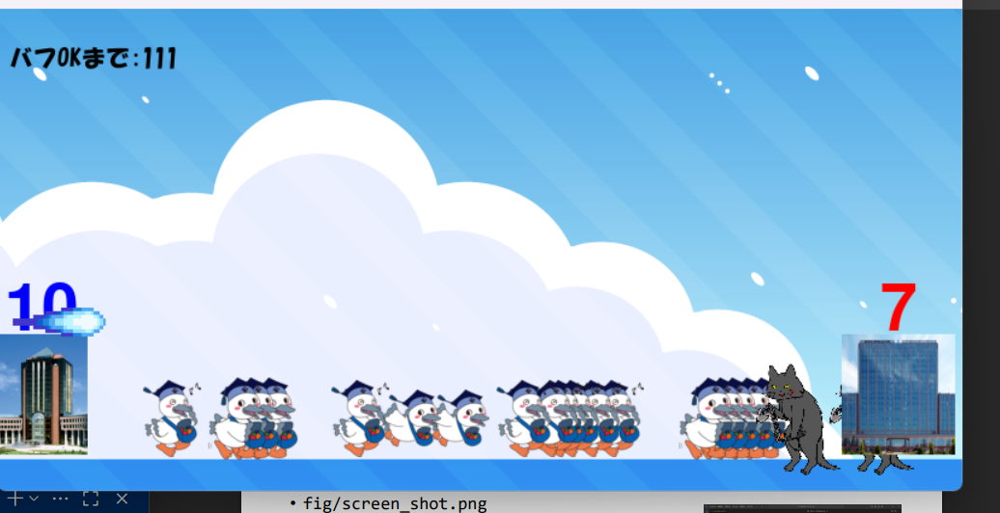

# こうかとん大戦争

## 実行環境の必要条件
* python >= 3.10
* pygame >= 2.1

## ゲームの概要
* 色んなこうかとんが敵の基地に目指して進撃し敵の城を撃破したらクリア
* 参考URL：[プログラミング教室テクノロにゃんこ大戦争](https://programming-school-technolo.com/?page_id=2621)

## ゲームの遊び方
* ゲームスタートをクリックでゲームを開始
* 味方：スペースキーでこうかとん普通
* Aキイで味方タンク
* Sきいで味方足早を出撃
* 敵の城を壊してゲームクリア
* 味方の城が壊れたらゲームオーバー

## ゲームの実装
### 共通基本機能
* スペースキーで「こうかとん（味方ユニット）」出撃
* 敵が定期的に出てくる
* こうかとん（味方ユニット）と敵がぶつかると戦う（HP減少）
* スペースキーで「こうかとん」出撃
* 敵が定期的に出てくる
* こうかとんと敵がぶつかると戦う（HP減少）
* 簡単なHP判定で削除される

### 分担追加機能
* 強力なこうかとんと強力な敵の追加
* バフ機能（担当:伊藤）一定時間経過までバフをかけられるようになるまでの時間を表示する。時間になると指示が表示され、bキーを押すと画面が緑に光り、画面内にいる味方ユニットの速度と与えるダメージを増加させる機能
* 髙田:エンディング実装（以下、詳細）
* 味方城と敵城を画面両端に表示する。
* どちらかの城の耐久値が０になったときに、爆破エフェクトを出す。
* 味方の耐久値が０の時はゲームオーバーと両端に泣いているこうかとん画像を表示する。
* 敵の耐久値が０の時はゲームクリアと両端に喜んでいるこうかとん画像を表示する。
* 数秒後、ゲームを終了する。 
* ゲームスタート画面の追加
* こうかとん砲の追加
* こうかとんバフ効果の追加

### ToDo
- 出来ればコスト設定をしたかった

### メモ
* 